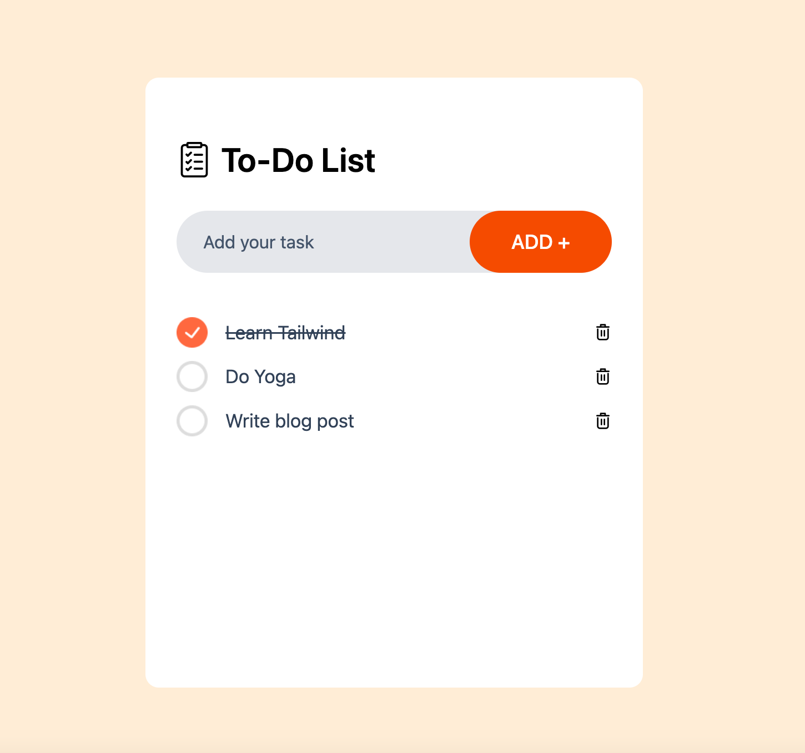

# 📝 To-Do List App

This is a simple To-Do List application built with **React** and **Tailwind CSS**.
This was created as a practice project to explore how to use Tailwind CSS for the first time!



## Features

- Add new tasks
- Delete tasks
- Mark tasks as completed

## Technologies Used

- [React](https://reactjs.org/)
- [Tailwind CSS](https://tailwindcss.com/)
- [Vite](https://vitejs.dev/)

## Getting Started

### 1. Clone the repository

```bash
git clone https://github.com/ito-miyuki/todo-app.git
```
### 2. Navigate into the project folder
```bash
cd todo-app
```
### 3. Install dependencies
```bash
npm install
```
### 4. Start the development server
```bash
npm run dev
```
Open http://localhost:XXXX in your browser to view the app.


## Inspiration
This project was inspired by the following tutorial:
[React + Tailwind CSS To-Do App Tutorial (YouTube)](https://www.youtube.com/watch?v=WE8aYoGK0Ec&ab_channel=GreatStack)


